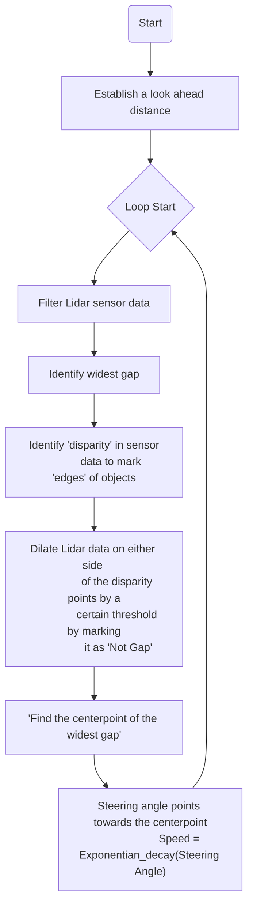

# F1Tenth_GapFollow
## Introduction

Gap following is a technique used in autonomous driving or robotics where a vehicle or robot navigates through an environment by identifying and following open spaces or "gaps" between obstacles.

The basic idea is to detect and pursue the widest available space or passage in the surroundings. This involves using sensors (like Lidar, cameras, or ultrasonic sensors) to perceive the environment and identify areas that are clear of obstacles. By following these open areas, the vehicle or robot can navigate safely and efficiently.

## Approach

<ins> **Context:** </ins>

Top View of the environment:

POV:

Lidar Data visualized in polar coordinates:

_The car is at the center of the polar coordinates (0,0)_  
_Black: Lidar Data_  
_Blue: Gap(s)_ 
_Green: Centerpoint of the largest gap_

**Definition of 'gap':**
If the Lidar data exceeds a certain threshold distance (look-ahead distance), it is assumed to be free space. Consecutive free spaces grouped together comprise of a gap.

<ins> **Vanilla Approach:** </ins>

The initial approach aimed to identify gaps, determine the largest one, and navigate towards its centerpoint. 

<ins> _Result:_ </ins>

https://github.com/imalhotra15/F1Tenth_GapFollow/assets/118845522/1232b635-21b0-4983-8219-a848ee4bb377

However, this method assumed the vehicle to be a point mass, neglecting the car's actual physical dimensions like track width and wheelbase. As a result, when maneuvering to avoid an obstacle based on the largest gap, there was a risk of the car's wider physical structure colliding with nearby obstacles or walls while following the next identified 'gap.'

<ins> **Dilating Edges:** </ins>

To compensate for the car's size and dimensions, a more sophisticated strategy involved 'dilating' the perceived 'obstacles' detected by the sensors. The dilation process aimed to expand the perceived obstacles' boundaries to account for the actual width of the car. This dilation operation prevented the vehicle from getting too close to obstacles or walls, effectively considering the car's dimensions during navigation.

_How to dilate obstacles?_

**1. Detecting Significant Changes in Sensor Values (diff_objs):**
This step involved analyzing the sensor data to identify significant changes or disparities in the readings within a specified distance range. These changes in sensor values indicated potential edges or boundaries of objects in the vehicle's surroundings.

**2. Dilation and Filtering Operations (isDiffHigh):**
Using the detected significant changes in sensor values, the algorithm performed dilation and filtering operations. The 'isDiffHigh' operation filtered areas where these disparities were observed, indicating potential locations of obstacles. By dilating these areas, the algorithm expanded the perceived obstacles' representation, effectively inflating their size virtually to account for the car's physical dimensions.

*Orange: Detected disparities (to detect obstacle edges*  
_Yellow: Updated Gap(s)_  
_Green: Centerpoint of the largest updated gap_

<ins> _Result:_ </ins>

https://github.com/imalhotra15/F1Tenth_GapFollow/assets/118845522/ed7b720f-686f-4091-9617-73664f413df0

The process of inflating or dilating the obstacles involved detecting notable changes in sensor readings to identify potential obstacles and applying filtering and dilation operations to expand these detected obstacles' boundaries, considering the vehicle's actual dimensions during navigation and obstacle avoidance.

<ins> **Speed and Steering Control:** </ins>

Steering Control: Points in the direction of the centerpoint of the largest (updated) gap -> Green point in the visualization

Speed Control: The speed is calculated as a function of the steering angle. The function used is an exponential decay function. This relationship between the steering angle and speed helps maintain traction. The coefficients should be adjusted according to the environment (tyre and surface interface) and the 'aggressiveness' desired.   

*Representation of exponential decay function*

## Final Result

Here's the video of the final result after careful hyperparameter tuning.

https://github.com/user-attachments/assets/75db6a11-7ef5-4acf-8b86-88e10ccd8f61

## The Algorithm

## Notes

This was done as a part of the coursework of CSE 568 at the University at Buffalo. The source code is not available publicly to avoid academic integrity violations. Please feel free to contact the author if you wish access to the source code.

## Acknowledgements

- [F1Tenth Simulator developed by Smit on Unity](https://github.com/SmitRajguru/f1tenth_simulator)
